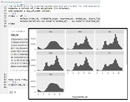
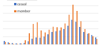
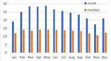
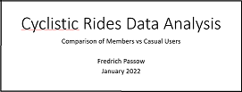

<a href="https://fpassow.github.io">&lt;&lt;HOME</a>

# Final Project for the Google Data Analytics Certificate Course

This is an analysis of rides data from "Cyclistic", a fictional bike-share company. Users remove a bike from one of the company's many stations around Chicago, and then return it to the same station or any other station. This is a "ride".

The company has two kinds of users, "casual" users and "members". Members pay a yearly fee. Casual users pay by the ride or by the day.

## The Question

"How do annual members and casual riders use Cyclistic bikes differently?"

## The Data

The data is really data shared by a real bike share company. 
CSV files of data about individual trips were downloaded from here: https://divvy-tripdata.s3.amazonaws.com/index.html

Data is available under this license: https://ride.divvybikes.com/data-license-agreement
We will use data from the last twelve complete months, December 2020 through November 2021.

## Aanalysis: R Notebook

[here](cyclistic_bike_share_analysis.html)
1. Read raw csv files
2. Combine and clean the data
3. Analyze for patterns
4. Export summary CSV files which were small enough to open in Excel

## Aanalysis: Excel Pivot Tables

[here](graphs_by_hour_and_weekday.xlsx)

[here](monthly_summary.xlsx)

## Presentation of Results

[here](cyclistic.pptx)